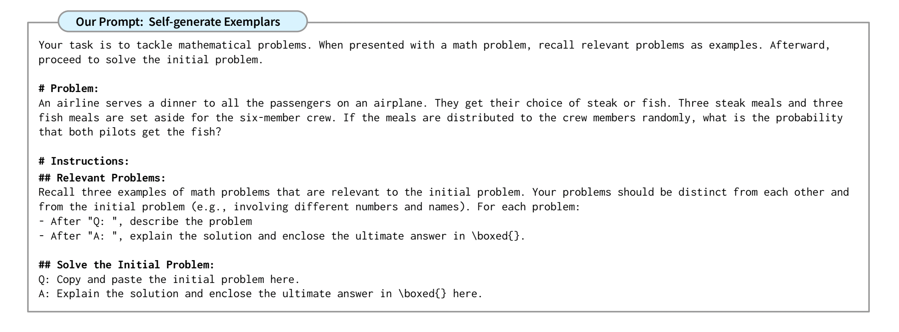

# Large Language Models for Travel Mode Tweets Analysis

Work done in Fall 2023 in collaboration with the DitecT Lab at Columbia. Leveraging prompt engineering techniques such as In-Context Learning, Chain-Of-Thoughts or Analogical Prompting Reasoning to conduct tweet analysis and understand transportation change behaviours.


# Setup the environment

# LLMs

I focused on 3 large language models to conduct my experiences:
    - GPT3.5
    - Mistral 7B
    - LLama 13B

# Dataset

The exploration work was carried out by experimenting on a custom dataset of tweets related to the NYC MTA. Example :

# Prompts

## In context Learning
This technique consists in applying a detailed prompt
engineering format to let the model learn from inference only.
As for instance in the *Input-Output* format of a query, where
one show the model examples of demonstration before asking
it to predict on a new input.


### My Prompt
In my case the in-context learning prompt consisted in the following:
```
Your goal is to retrieve the travel mode, the satisfaction (it has to be True or False) and the reason of the satisfaction, from a tweet.


            ### Examples:

            Tweet : " Jesus, I've been waiting at this train station for an hour, they do not seem to be rushing to solve the left package issue... I hate NYC transit"
            ["travel_mode" : "Train", "satisfaction" : "False", "reason": "left package"]
                
            Tweet: "My computer died 3 hours ago"
            ["travel_mode" : "N/A", "satisfaction" : "N/A", "reason": "N/A"]

            ### Now give me the output for this tweet :
            {tweet}


            ONLY ANSWER WITH THE JSON OUTPUT FORMAT 
```

## Chain of Thougts

Is a specific In-Context learning format: It consists in specifying a series of intermediate reasoning steps to the model that leads to solve a problem in hand. 


### My Prompt
In my case the COT prompt consisted in the following:
```
Your goal is to retrieve the travel mode, the satisfaction (it has to be True or False) and the reason of the satisfaction, from a tweet.


            ### Examples:

            Tweet : " Jesus, I've been waiting at this train station for an hour, they do not seem to be rushing to solve the left package issue... I hate NYC transit"
               
                In this tweet, the user mentionned the train, it is obviously the travel mode. They also mentionned a long waiting time with an injuction "Jesus" which refers to a non satisfaction and also gives the reason : long waiting time because of a left package issue.
            
                ["travel_mode" : "Train", "satisfaction" : "False", "reason": "left package"]
                
            Tweet: "My computer died 3 hours ago"
               
                In this tweet, no mention of any travel mode is done. So we cannot determine any.

                ["travel_mode" : "N/A", "satisfaction" : "N/A", "reason": "N/A"]

            ### Now give me the output for this tweet :
            {tweet}


            ONLY ANSWER WITH THE JSON OUTPUT FORMAT 
```

## Analogical Prompting

Techniques such as In-Context Learning or CoT have been proved to work pretty well but still present the drawback of needing handwritten exemplars to be inputed to the model. This can represent a significant amount of time in the case of CoT for instance. This technique aims to allow models to generate themselves the exemplars, and hence to obviate the need for labeling or retrieving exemplars. Based on the idea that modern LLMs possess a broad range of problem-solving knowledge acquired during training. Explicitly prompting them to recall or generate relevant problems and solutions in context aids LLMs to perform in-context learning to solve new problems.

Below is an example of prompting.



### My Prompt
In my case the COT prompt consisted in the following:
```
Your goal is to retrieve the travel mode, the satisfaction (it has to be True or False) and the reason of the satisfaction, from a tweet.

                When presenting a given tweet, recall three relevant tweets as example. The relevant tweets should be distinct from each other and
                from the initial one (e.g., involving different modes and reasons of satisfaction). For each example answer to the questions.Afterward, proceed to detect the travel mode in the initial tweet, the satisfaction regarding it and the reason.
               
                ONLY ANSWER WITH a JSON OUTPUT FORMAT. your answer has to get the following fields with the same structure. I wrote you a description of each one :
                
               ["example_1" : Recall a first example of tweet that is relevant to the initial tweet,
               ("tweet" : Write the first tweet example,
               "travel_mode_1": This is the travel mode for the first  example,
               "satisfaction_1": This is the satisfaction towards the travel mode for the first  example,
               "reason_1": This is the reason of the satisfaction for the first  example,)
               "example_2" : Recall a second example of tweet that is relevant to the initial tweet,
               ("tweet" : Write the second tweet example,
               "travel_mode_2": This is the travel mode for the second example,
               "satisfaction_2": This is the satisfaction towards the travel mode for the second example",
               "reason_2": This is the reason of the satisfaction for the second example,)
               "example_3": Recall a third example of tweet that is relevant to the initial tweet,
               ("tweet" : Write the third tweet example,
               "travel_mode_3": This is the travel mode for the third example,
               "satisfaction_3": This is the satisfaction towards the travel mode for the third example,
               "reason_3": This is the reason of the satisfaction for the third example,)
               "travel_mode": This is the travel mode for the initial tweet, return 'N/A' if non applicable,
               "satisfaction": This is the satisfaction towards the travel mode for the initial tweet, return 'N/A' if non applicable,
               "reason": This is the reason of the satisfaction for the initial tweet, you can be exhaustive here. Return 'N/A' if non applicable
               ]
               
               ### Generate examples
               For each of the example you recall, detect the travel mode, the satisfaction and the reason. You will incorporate them in the final output.

                ### Now answer for this tweet :
                {}
```


| Yolo    | Total number of Params | Params in the Detect heads |
| -------- | ------- | --------|
| Nano| 3.1M|   800k  |
| Small| 11.1M| 2.14M|
| Medium| 25.9M|  3.8M |
| Large| 43.6M|  5.6M |
| XL| 59.4| 8.7M  |

# Evaluate a Model